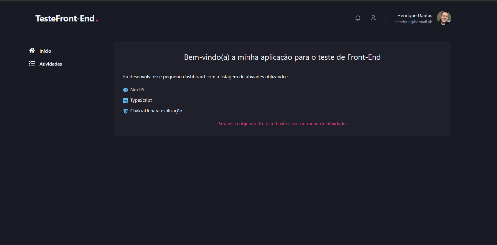

## Como utilizar o projeto?

Primeiro, clone o repositorio utilizando o seguinte comando em seu terminal:
OBS: Necessário ter o git instalado em sua máquina

```bash
git clone https://github.com/henriquedantass/testFront.git
instalando dependencias com yarn ou npm install
```

Depois  inicie o servidor com os seguintes comandos em seu terminal:

```bash
npm run dev
# or
yarn dev
```

<h1 align="center">
{ Teste Front }
</h1>
 
<br>

<p align="center">
  <a href="#-tecnologias">Tecnologias</a>&nbsp;&nbsp;&nbsp;|&nbsp;&nbsp;&nbsp;
  <a href="#-projeto">Projeto</a>&nbsp;&nbsp;&nbsp;|&nbsp;&nbsp;&nbsp;
</p>

<br>

<p align="center">
  
  

</p>

## 🚀 Tecnologias

Esse projeto foi desenvolvido utilizando:
- NextJS
- TypeScript
- Unform
- ChakraUI


